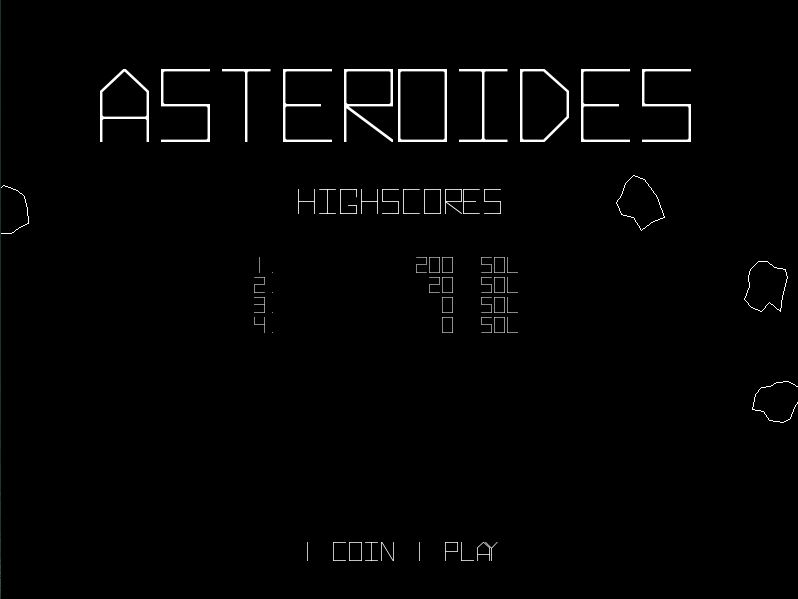
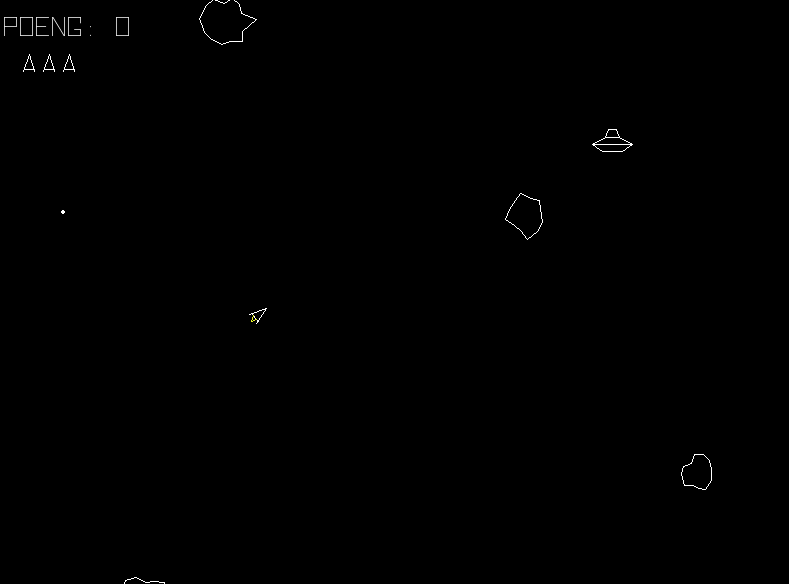
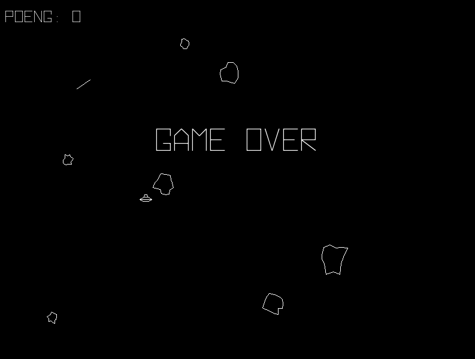

# Asteroids

This is my attemt to make a clone of the 1979 game Asteroids. 
It's my first game in pygame and i've used several other projects 
on Github as inspiration. I hope you enjoy it.

### Ship controls:
* Arrow forward     : Thrust
* Arrow left/right  : Rotate ship
* Space             : Fire
* Left shift        : Hyperspace

### Installation
1. Clone Asteroids to your machine.
2. Install [Python 3](https://www.python.org/downloads/)
3. Create a virtual enviroment (optional). <code>python -m venv \<name of enviroment></code>
4. In the comandline type: <code>pip install /r requirements.txt</code>
5. In the comandline type: <code>python3 asteroids.py</code>

 

  
  
  

 

Sounds taken from:
http://www.classicgaming.cc/classics/asteroids/sounds
