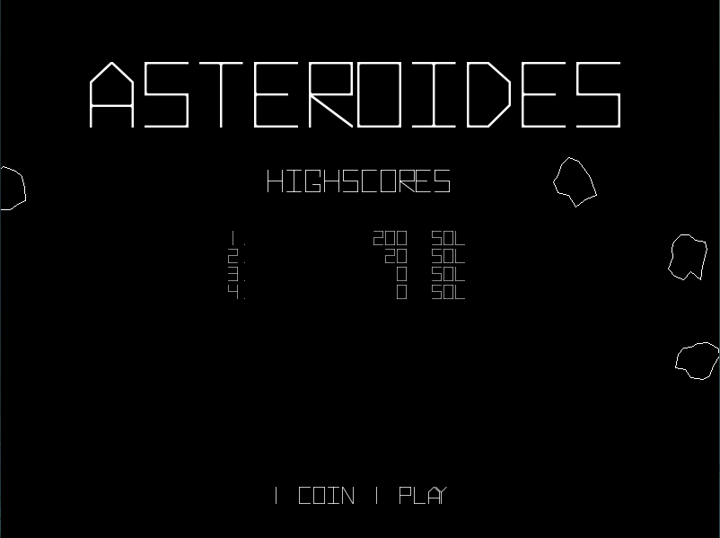
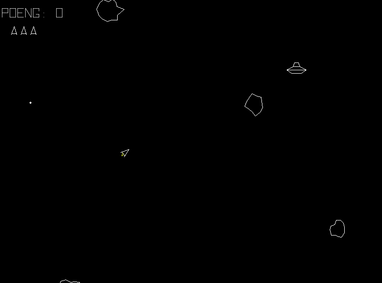

# Asteroids

This is my attemt to make a clone of the 1979 game Asteroids. 
It's my first game in pygame and i've used several other projects 
on Github as inspiration. I hope you enjoy it.

### Ship controls:
* Arrow left/right  : Rotate ship
* Space             : Fire
* Left shift        : Hyperspace

### Installation
1. Install [Python 3](https://www.python.org/downloads/)
2. In the comandline type: pip install /r requirements
3. In the comandline type: python3 asteroids.py

 

  
  
  

 

Sounds taken from:
http://www.classicgaming.cc/classics/asteroids/sounds
